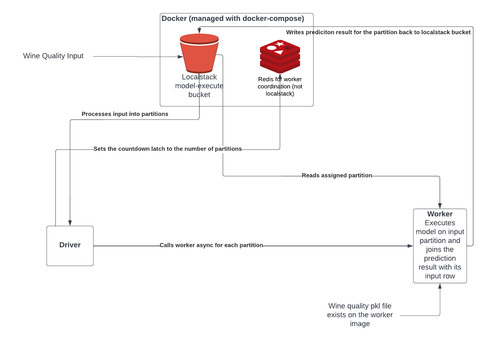

# model-execute
Codebase for model exection using fan in pattern

# Overview



## Function Entrypoints
- Driver: modelexecute/driver/handler.py
- Worker: modelexecute/worker/handler.py

Using make, the modelexecute package is copied into each function's docker build context and installed on the image during build.

## modelexecute

Model execute contains the core classes used in the process by both the worker and driver.

  - modelexecute/modelexecute/awssession.py is just a reusable boto3 instance setup to work with localstaack
  
  - modelexecute/modelexecute/latch.py contains the CountdownLatch class which is used to interface with redis to set the countdown value and to decrement that value.
  
  - modelexecute/modelexecute/partition.py calculates model input partitions which are defined by an offset and a length. It can also be used to read specific partitions from the s3 bucket.
  
  - modelexecute/modelexecute/modelmanager.py contains the Model and ModelDef classes which are used to handle the loading of the model, the execution of the predictions, and the writing of the results back to s3.

# Dev Env Setup

## Prereqs

- make
- docker
- awscli-local (pip install awscli-local)
- faas-cli
- minikube / KinD with an installation of OpenFaas
- OpenFaas gateway is port-forwarded and faas-cli is authenticated

## Setup Dev Environment

  - Update the ```LOCALSTACK``` variable in the stack.yml file for each function
    - ```LOCALSTACK=host.docker.internal``` for KinD
    - ```LOCALSTACK=host.minikube.internal``` for minikube
## Startup Dev Environment

Run the following commands:

- Start docker services
  - ```make start-env```
  
- Seed model input data in localstack s3 so it can be accessed by driver and worker
  - ```make seed-model-input```

## Deploying functions in dev environment

### clean
```make clean```
- Removes the python build files from the project.
- Removes modelexecute package from the driver and worker directories.
- Removes egg-info

### build
```make build```
- Prepares the driver and worker docker build contexts and builds the images

### push
```make push```
- pushes dockerfiles for worker and driver to registry

### deploy
```make deploy```
- deploys functions to local openfaas using faas-cli

### full deploy
```make clean build push deploy```

# Calling the driver

- Put input data into a localstack bucket.
- Invoke the function with the following JSON body.
  ```json
  {
    "bucket":"model-execute", 
    "key":"model_input.json",
    "max_partition_size": 30000
  }
  ```